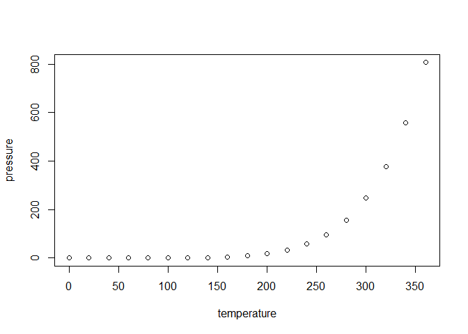

## Initial Research

-   **Redistricting Status:**
    -   Missouri: Governor Mike Kehoe signed new map into law on
        September 28, 2025.
    -   New York: Litigation ongoing. Redistricting is not guaranteed.
-   **Redistricting Reasoning:**
    -   Missouri: Voluntarily redistricted.
    -   New York: Redistricting potential due to litigation.
-   **Sources:**
    -   <https://ballotpedia.org/Redistricting_in_New_York_ahead_of_the_2026_elections>

## Temp Plot

