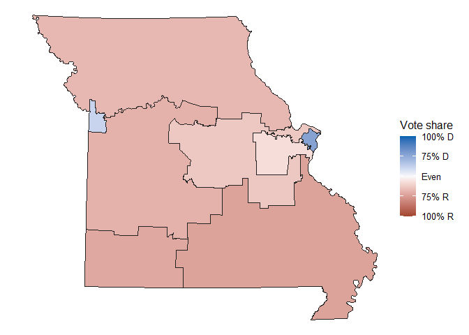
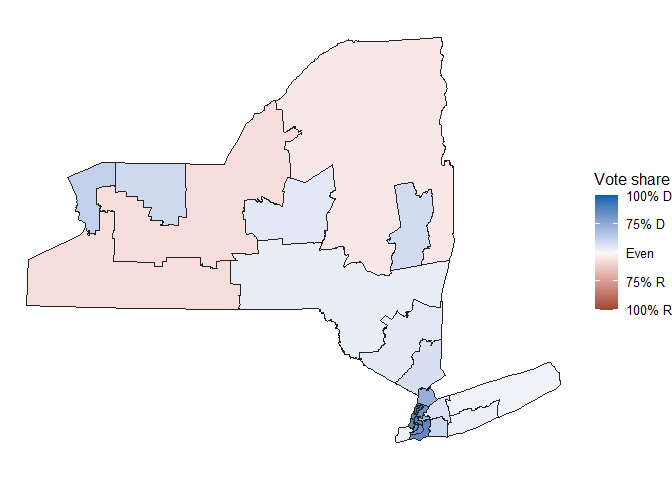

## Initial Research

-   **Redistricting Status:**
    -   Missouri: Governor Mike Kehoe signed new map into law on
        September 28, 2025.
    -   New York: Litigation ongoing. Redistricting is not guaranteed.
-   **Redistricting Reasoning:**
    -   Missouri: Voluntarily redistricted.
    -   New York: Redistricting potential due to litigation.
-   **Source:**
    -   <https://ballotpedia.org/Redistricting_in_New_York_ahead_of_the_2026_elections>

## Basic Missouri District Map

-   I confirmed that I generated the correct map with this website:
    <https://www.zipdatamaps.com/politics/national/districts/map-of-missouri-congressional-districts>.

## Basic New York District Map

-   I confirmed that I generated the correct map with this website:
    <https://www.zipdatamaps.com/politics/national/districts/map-of-new-york-congressional-districts>.

-   This appears to be be New York’s current congressional boundaries. I
    need to do more research to figure out how to make a map of the
    proposed congressional boundaries. This is a comparison of the
    different boundaries that I found:
    <https://nyirc.gov/congressional-plan-2024>.

## Questions

-   How can we create a system to efficiently compare different
    historical congressional boundaries in our states? Is such a system
    necessary for this project?

-   What questions is our project trying to answer?
